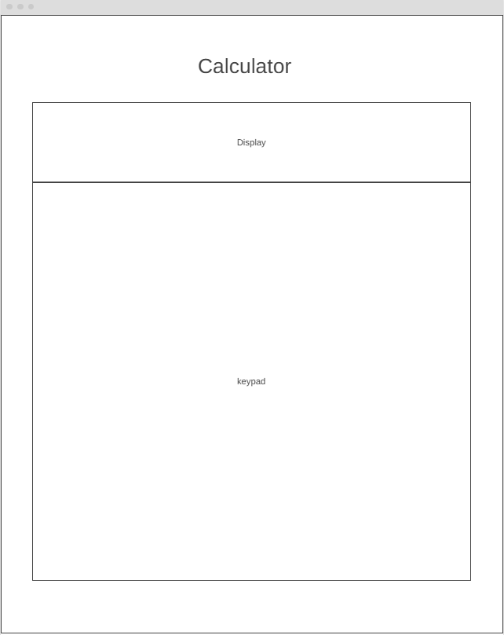

# Design

## Project's design overview

>

- The Calculator will provide User-Friendly Interface: A clean layout with large, easy-to-read buttons and display.
- Essential Functions: Inclusion of basic arithmetic operations without overwhelming users with advanced features.
- The calculator project meets the needs of its intended audience, providing a functional and accessible tool for everyday calculations.

## Wireframe(s)

>

